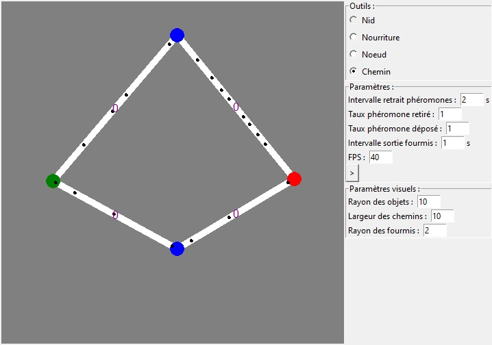
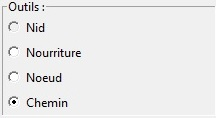
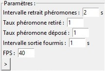
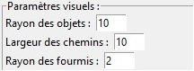

# Python-Ant-Algorithme

This is a reproduction of the Ant Algorithme. You can create a graph with an ant nest node and a food node and see how ants fetch food.
## Features
- Graph creator
- Settings modifiers
## Installation
1. Download the repository by clicking on `Code > Download ZIP`
2. Extract the ZIP file
3. Run `main.pyw`
## Requirements
- Python 3.7
- Python tkinter library
- Python random library
- Python time library
- Python math library
## Usage
To create a graph you can select a tool using this section :

- `Nid` allows you to add the nest node from which the ants will come out
- `Nourriture` allows you to add the food node the ants will search
- `Noeud` allows you to create a node from wich paths can be create
- `Chemin` allows you to create a path between two nodes by clicking successively on one node then on the other

To add a node you have to use `LEFT` mouse button and to delete a node you have to use `RIGHT` mouse button.

You can ajust simulation settings using this section :

- The first line allows you to set the interval between 2 pheromone withdrawals
- The second line represent the level of pheromones removed each time
- The third line is the level of pheromones deposited per each ant
- The fourth line represent the time interval between 2 ants exits
- The last line is the number of frames processed per second
- The button allows you to pause the simulation

You can ajust visual settings using this section :

- The first line allows you to set the radius of the circles which represent the nodes
- The second line is the width of the lines which represent the paths
- The last line represent the radius of the circles which represent the ants